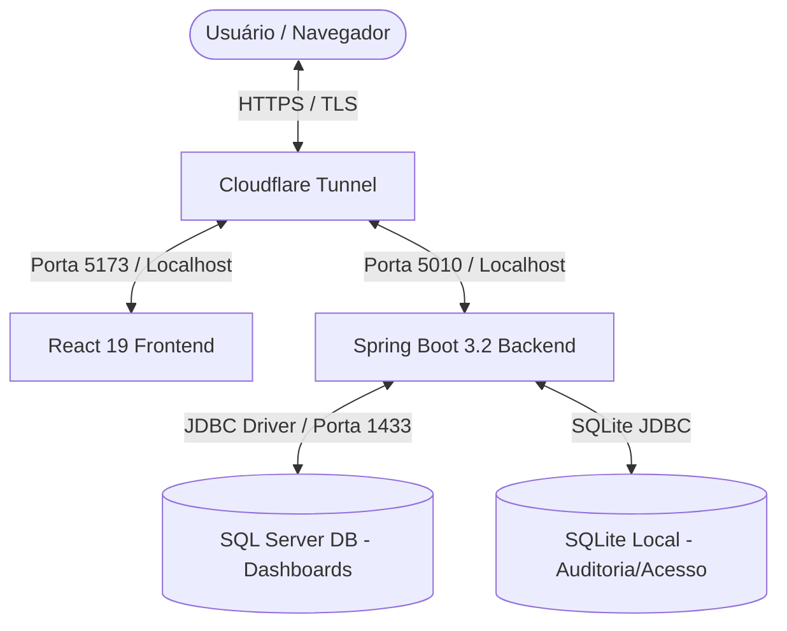

# 📈 Portal de Dashboards & Monitoramento ETL - Monorepo

> **Atenção:** Este é um Monorepo empresarial composto por um backend Spring Boot robusto e um frontend React de alta performance, projetado para consolidar indicadores operacionais, financeiros, de auditoria e de saúde de processos ETL da **RodoGarcia**.

---

## 🗺️ Visão Geral & Arquitetura do Sistema

O portal centraliza a inteligência de negócios e a auditoria operacional da empresa. Ele consome dados refinados a partir de views no **SQL Server** (alimentadas pelo processo de ETL), implementa controles de acesso baseados em ACL (Access Control Lists) e oferece uma experiência de usuário rica em gráficos e filtros integrados.

### Fluxo de Comunicação e Segurança



---

## 🧭 Escopo e Recursos do Portal

### 🔒 10 Áreas Operacionais Protegidas
O frontend implementa roteamento seguro e autorização granular por setor para dez painéis críticos:
1. **Coletas**: Monitoramento de agendamentos, carregamento e performance de coletas.
2. **Manifestos**: Status de expedição, vinculação operacional e rotas ativas.
3. **Fretes**: Análise financeira de fretes contratados e liquidações.
4. **Tracking**: Rastreamento em tempo real de viagens, paradas e SLA de entrega.
5. **Faturas**: Emissões, conciliação de faturas operacionais e status de pagamento.
6. **Faturas por Cliente**: Visão detalhada de faturamento agrupado por tomador de serviço.
7. **Contas a Pagar**: Lançamentos, provisões de saídas e fluxo de caixa operacional.
8. **Cotações**: Taxa de conversão de propostas comerciais e volumetria.
9. **Executivo**: Dashboard consolidado de KPIs estratégicos para a diretoria.
10. **ETL Saúde**: Monitoramento de integridade das sincronizações diárias (GraphQL e Data Export), contagem de órfãos e falhas de processo.

### 🛠️ Área Administrativa & ACL
* **Gestão de Setores**: Criação de agrupamentos operacionais com permissões específicas.
* **Gestão de Usuários**: Cadastro com definição de perfis, senhas fortes obrigatórias com validações no servidor e controle de status.
* **Autenticação Avançada**: Sessões baseadas em tokens JWT com refresh token rotativo para evitar expirações abruptas.

---

## 🛠️ Tecnologias Utilizadas (Tech Stack)

### ☕ Backend
* **Java 17 & Spring Boot 3.2.5**
* **Spring Security & Spring Data JPA**
* **Microsoft JDBC Driver para SQL Server**
* **SQLite JDBC Driver** (para auditoria local e redundância de segurança)
* **JWT (JSON Web Tokens - `jjwt-api` / `jjwt-impl`)** para controle de sessões sem estado.
* **Spring Boot Actuator**: Monitoramento de integridade e endpoints de liveness/readiness.

### ⚛️ Frontend
* **React 19 & TypeScript & Vite**
* **React Router DOM v6** (controle de rotas e rotas protegidas)
* **TanStack Query (React Query) v5** para cache inteligente de requisições de API.
* **Axios** para cliente HTTP com interceptores automáticos de refresh token.
* **Apache ECharts**: Biblioteca avançada de visualização de dados e gráficos interativos.
* **Tailwind CSS v4** para estilização de interface ultra-rápida e moderna.

---

## ⚙️ Variáveis de Ambiente & Configurações

O monorepo utiliza arquivos `.env` para orquestrar as portas e origens corretas por ambiente. Utilize o arquivo `.env.example` como base local.

### Template Padrão de Configurações (`.env`)

```properties
# --- Servidor do Backend API ---
SERVER_ADDRESS=127.0.0.1
API_BASE_URL=http://127.0.0.1:5011
VITE_API_BASE_URL=http://127.0.0.1:5011

# --- Banco de Dados Principal ---
DB_URL=jdbc:sqlserver://HOST:1433;databaseName=DASHBOARDS;encrypt=true;trustServerCertificate=true
DB_USER=seu_usuario
DB_PASSWORD=sua_senha

# --- Chaves de Segurança ---
JWT_SECRET=segredo-forte-unico-por-ambiente-gerado-com-sha256
API_KEY=chave-forte-unica-para-comunicacao-entre-servicos-internos

# --- Controle de CORS ---
CORS_ORIGENS_PERMITIDAS=http://localhost:5174,http://127.0.0.1:5174

# --- Parâmetros Extras de Sessão ---
AUTH_SESSION_EXPIRACAO_HORAS=24
AUTH_REFRESH_COOKIE_SAME_SITE=Lax
AUTH_REFRESH_COOKIE_SECURE=false

# --- Migração Temporária ---
ACL_LEGACY_MIGRATION_ENABLED=false
```

> [!WARNING]
> **Segurança em Produção:**
> * Nunca versione credenciais reais ou chaves criptográficas no Git.
> * Em produção, mude `CORS_ORIGENS_PERMITIDAS` para apontar exclusivamente para a URL do domínio final: `https://analytics.rodogarcia.com.br`.
> * Para Cloudflare Tunnel com terminação SSL externa, mantenha `AUTH_REFRESH_COOKIE_SAME_SITE=None` ou `Lax` dependendo da arquitetura cross-site, com `AUTH_REFRESH_COOKIE_SECURE=true`.

---

## 📁 Estrutura de Pastas do Monorepo

```text
dashboards/
├── .vscode/               # Configurações recomendadas para o VS Code
├── backend/               # Código-fonte da API Spring Boot
│   ├── .mvn/              # Wrapper do Maven
│   ├── logs/              # Arquivos de log gerados em tempo de execução
│   ├── src/               # Código Java 17 e Migrations do Flyway
│   ├── storage/           # Banco SQLite local e chaves de segurança
│   ├── mvnw.cmd           # Executável do Maven no Windows
│   └── pom.xml            # Gerenciador de dependências Maven
├── frontend/              # Código-fonte da aplicação React
│   ├── dist/              # Build estático gerado para produção
│   ├── node_modules/      # Dependências do Node.js
│   ├── public/            # Ativos públicos (favicons, imagens estáticas)
│   ├── src/               # Componentes, Páginas, Hooks e Contexts React
│   ├── package.json       # Configuração de scripts e dependências do Node.js
│   └── vite.config.ts     # Configurações do Vite
├── public/                # Ativos compartilhados do monorepo
├── docs/                  # Documentações funcionais e técnicas consolidada
├── iniciar-dev.bat        # Inicializador rápido para ambiente local (Dev)
└── iniciar-prod.bat       # Script de build e verificação de integridade (Prod)
```

---

## 🚀 Como Executar o Projeto

### Modo Automático (Windows)

#### 💻 Ambiente de Desenvolvimento
Para subir o frontend e o backend em paralelo, com recarregamento rápido (Hot Reload), execute no PowerShell/CMD na raiz:
```powershell
.\iniciar-dev.bat
```
* O backend subirá na porta `5011` (`http://localhost:5011`).
* O frontend subirá na porta `5174` (`http://localhost:5174`).

#### 🏭 Ambiente de Produção (Homologação / VM)
Para compilar e subir o bundle otimizado simulando o ambiente de produção localmente ou na VM:
```powershell
.\iniciar-prod.bat
```
* O script valida se as variáveis necessárias estão ativas.
* Compila o frontend gerando a pasta `dist`.
* Valida a inicialização da API na porta de produção `5010`.
* Executa testes automáticos de integridade (preflight CORS) antes de finalizar.

---

### Execução Manual

#### ☕ Iniciando o Backend
1. Navegue até a pasta do backend:
   ```powershell
   cd .\backend
   ```
2. Inicialize o serviço em modo desenvolvimento:
   ```powershell
   .\mvnw.cmd spring-boot:run
   ```
3. Para executar o JAR empacotado explicitamente no Windows:
   ```powershell
   & "$env:JAVA_HOME\bin\java.exe" -jar .\target\dashboard-api-1.0.0.jar
   ```

#### ⚛️ Iniciando o Frontend
1. Navegue até a pasta do frontend:
   ```powershell
   cd .\frontend
   ```
2. Instale as dependências (caso seja a primeira execução ou após atualizações):
   ```powershell
   npm install --legacy-peer-deps
   ```
3. Execute o servidor de desenvolvimento Vite:
   ```powershell
   npm run dev
   ```

---

## 🌐 Configuração de Produção & Cloudflare Tunnel

Ao subir o ambiente em VM utilizando o **Cloudflare Tunnel**, garanta o alinhamento de portas e segurança:

1. **API Backend**: Responde localmente a requisições do túnel. Configure `SERVER_ADDRESS=127.0.0.1` e porta `5010`.
2. **Políticas de CORS**: Apenas a URL externa do front-end deve constar nas origens permitidas (`https://analytics.rodogarcia.com.br`).
3. **Cabeçalhos Proxy**: Habilite `SECURITY_TRUST_FORWARDED_HEADERS=true` no `.env` do backend para interpretar corretamente IPs de clientes vindos de trás do Cloudflare Tunnel.

---

## 🔑 Segurança da Sessão e Usuário Supremo

O portal implementa proteção estrita contra roubo de tokens e vazamento de privilégios:

* **Refresh Tokens Rotativos**: Armazenados em cookies `HTTP-Only` e `Secure`, bloqueando acesso via scripts JS (XSS).
* **Renovação Silenciosa**: Enquanto o usuário estiver ativo na aba, a autenticação será estendida de forma transparente. Uma inatividade prolongada ou falha severa na API não redirecionará o usuário instantaneamente para `/login`, melhorando o uso em telões de monitoramento de TV.
* **Usuário Supremo de Backup**: Credenciais para recuperação emergencial da ACL e acesso administrativo. As credenciais nunca ficam chumbadas no código, sendo lidas de variáveis de ambiente:
  ```properties
  ACESSO_USUARIO_SUPREMO_EMAIL=supremo@suaempresa.com
  ACESSO_USUARIO_SUPREMO_SENHA=senha-super-secreta
  VITE_ACESSO_USUARIO_SUPREMO_PAPEL=ROLE_ADMIN
  ```

---

## 🛠️ Resolução de Problemas & Encoding SQL Server

### Textos Corrompidos na Área Administrativa (Mojibake)
Se você identificar acentos ou cedilhas quebrados nas descrições de setores ou permissões vindas do SQL Server local devido à colação (Collation) incorreta, execute o script corretivo de migração:

```sql
-- Executar no banco de dados DASHBOARDS
-- Localizado em: backend/src/main/resources/db/migration/V004__corrigir_mojibake_acesso.sql
```

Para conferir se restam registros inconsistentes no banco, utilize a query de auditoria:
```sql
SELECT 'setores.nome' AS alvo, COUNT(*) AS qtd FROM acesso.setores
WHERE nome COLLATE Latin1_General_100_BIN2 LIKE N'%' + NCHAR(195) + N'%' OR nome COLLATE Latin1_General_100_BIN2 LIKE N'%' + NCHAR(194) + N'%'
UNION ALL
SELECT 'setores.descricao', COUNT(*) FROM acesso.setores
WHERE descricao COLLATE Latin1_General_100_BIN2 LIKE N'%' + NCHAR(195) + N'%' OR descricao COLLATE Latin1_General_100_BIN2 LIKE N'%' + NCHAR(194) + N'%'
UNION ALL
SELECT 'papeis.descricao', COUNT(*) FROM acesso.papeis
WHERE descricao COLLATE Latin1_General_100_BIN2 LIKE N'%' + NCHAR(195) + N'%' OR descricao COLLATE Latin1_General_100_BIN2 LIKE N'%' + NCHAR(194) + N'%'
UNION ALL
SELECT 'permissoes.nome', COUNT(*) FROM acesso.permissoes
WHERE nome COLLATE Latin1_General_100_BIN2 LIKE N'%' + NCHAR(195) + N'%' OR nome COLLATE Latin1_General_100_BIN2 LIKE N'%' + NCHAR(194) + N'%';
```

---

## 📚 Documentação de Apoio Detalhada

Para aprofundar-se em aspectos técnicos específicos, consulte os relatórios técnicos e guias salvos no diretório `/docs`:

* 📂 [Guia Geral de Documentos](file:///C:/Users/suporte/Documents/projetos/dashboards/docs/README.md): Índice principal de arquivos.
* 📄 [Relatório de Refatoração Consolidada](file:///C:/Users/suporte/Documents/projetos/dashboards/docs/relatorio-refatoracao-consolidada.md): Histórico de melhorias aplicadas ao código.
* 🔒 [Hardening de Segurança e Sessões](file:///C:/Users/suporte/Documents/projetos/dashboards/docs/relatorio-reestruturacao-acesso-sessao.md): Detalhes da implementação de Cookies Seguros e proteção JWT.
* ⚙️ [Guia de Integração SQL, DTOs e Views](file:///C:/Users/suporte/Documents/projetos/dashboards/docs/GUIA-INTEGRACAO-SQL-DTOS-VIEWS.md): Padrão de desenvolvimento para novos painéis ou novos campos no banco.
* 📊 [Catálogo de Views de BI](file:///C:/Users/suporte/Documents/projetos/dashboards/docs/relatorio-bi-catalogo-views.md): Mapeamento completo das colunas e tabelas consultadas para a montagem dos gráficos.
